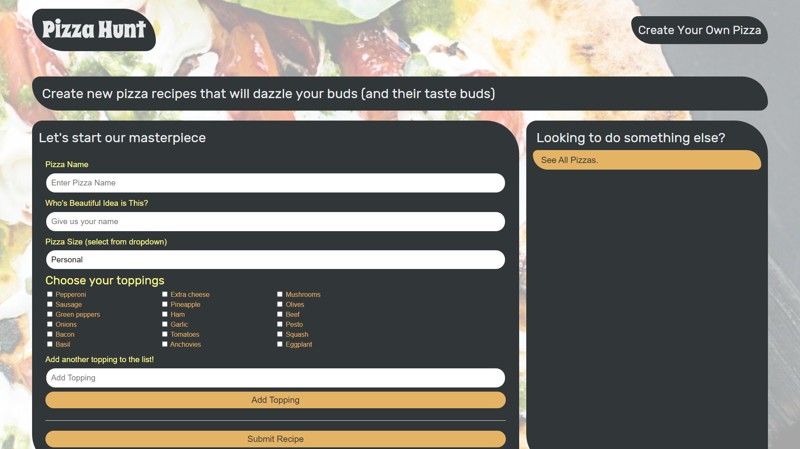

# Pizza Hunt
[](https://opensource.org/licenses/MIT)

## Description

This project served as an introduction to NoSQL, MongoDB, and the Mongoose ODM technologies. I created a web app that allows users to create and save their own custom pizza recipes using MongoDB as the database. Users can also view other users' pizza recipes and leave comments on them. The app utilizes MongoDB's flexible schema and scalability to efficiently handle and store the large amounts of recipe and user data.

## Table of Contents

* [Installation](#installation)
* [Usage](#usage)
* [Screenshots](#screenshots)
* [Technologies Used](#technologies-used)
* [Credits](#credits)
* [Links](#links)
* [License](#license)

## Installation

To install this application on your local machine:

- Clone the application's repository and place it into a local directory on your computer.
- Ensure that your computer has node.js installed.
- Open a command-line interface (VS Code, Git Bash, etc.) and navigate to the root directory.
- In the command-line, install the application's dependencies by typing the following command. The application will install dependencies for both the server and client directories.
```
    npm install
```
- Start the application by typing the following command. Your default web browser will then open the application in a new tab. 
```
    npm run start
```

## Usage

To use this application, users can view pizza recipies saved to the MongoDB database on the homepage. To create a pizza recipie, click on the "Create a New Pizza" button. Users will be taken to another page displaying a form for them to fill out their recipie details. Users can submit a pizza name, size, choose toppings or add another topping to the list, and the name of the user that submitted the recipie. On submit, the newly created pizza recipie will be displayed on the homepage. To view and add comments to a pizza recipie, click on the "See the discussion" button at the bottom of the recipie card. Users can leave comments or reply to other users' comments.

## Screenshots

The following images demonstrate the application's appearance and functionality.



## Technologies Used

- NoSQL
- MongoDB
- Mongoose ODM

## Credits

- [kt946](https://github.com/kt946)

## Links

- [Link to deployed application on Heroku](https://pizza-hunt-13648.herokuapp.com/)

- [Link to GitHub repository](https://github.com/kt946/pizza-hunt)

## License

This application is covered under the [MIT](https://opensource.org/licenses/MIT) License.
